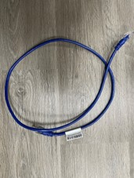
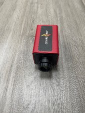
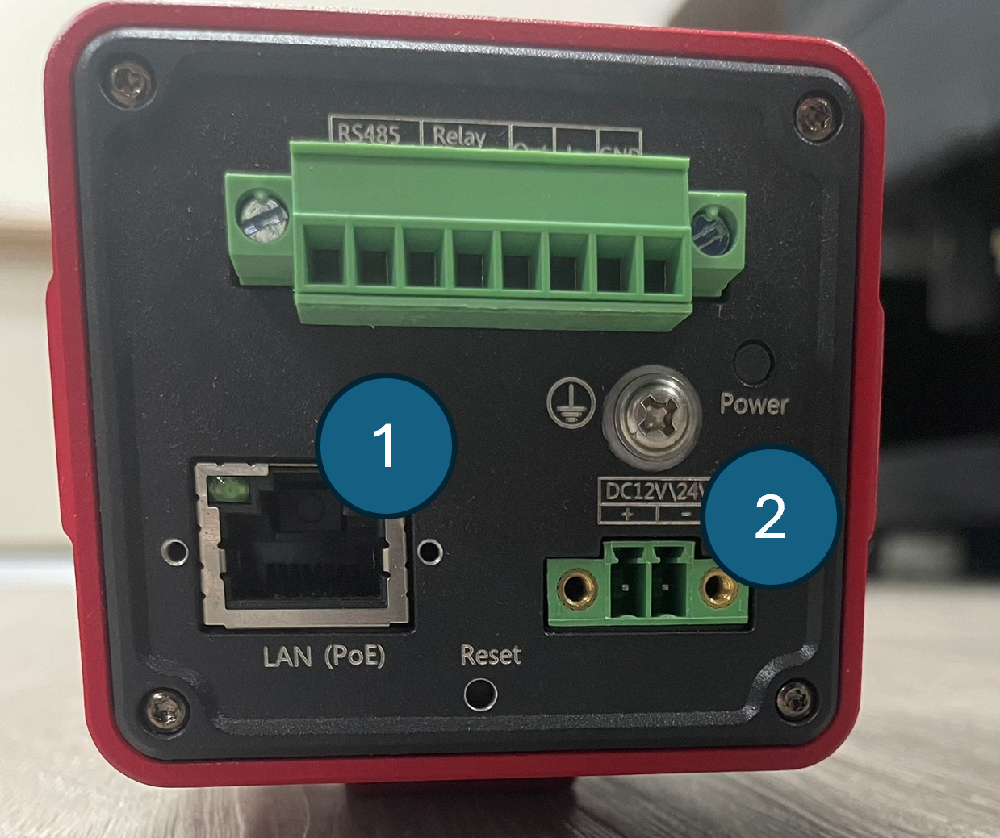
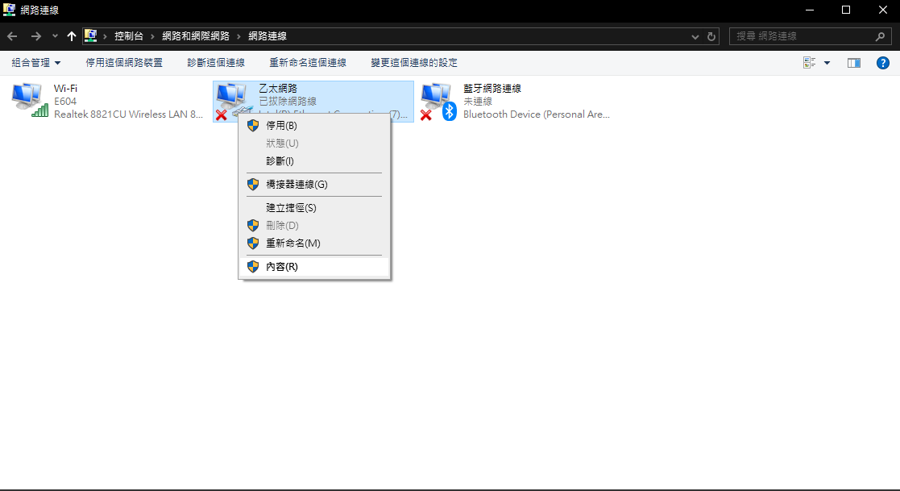
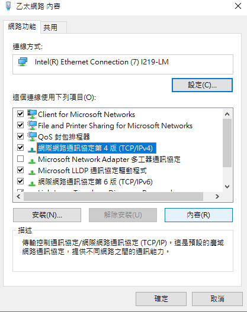
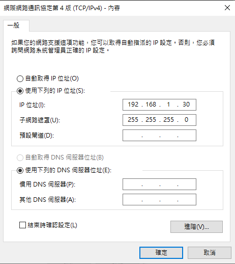
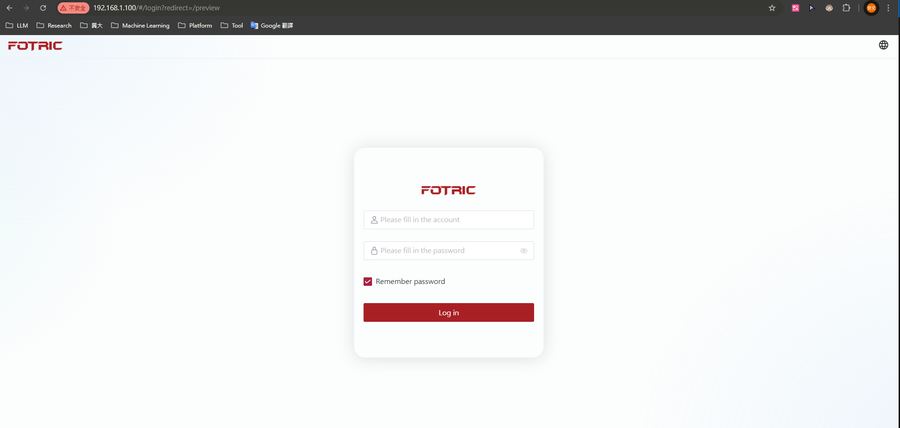

# 📷 FOTRIC 615C 熱像儀整合說明與開發手冊 (C#)

###### 🏷 Tags: `Lab Equipment` `C#` `熱像儀` `DLL開發`

---

## 📚 目錄

- [📌 廠商基本設定須知](#-廠商基本設定須知)
- [I. 🔌 硬體連接與網路設定](#i--硬體連接與網路設定)
  - [🧰 設備材料](#-設備材料)
  - [🧯 設備接法](#-設備接法)
  - [🖥 網路設定與熱像儀連線](#-網路設定與熱像儀連線)
- [II. ⚙️ 軟體環境建置與專案設定](#ii--軟體環境建置與專案設定)
  - [📦 原始檔下載](#-原始檔下載)
  - [🛠 專案建置步驟](#-專案建置步驟)
  - [🔧 DLL 編譯為 x64](#-dll-編譯為-x64)
- [III. 📁 函式庫介紹](#iii--函式庫介紹)
  - [OWBTypes.cs](#owbtypescs)
  - [OWBCamera.cs](#owbcameracs)
- [IV. ❗️ 問題排除](#iv--問題排除)

---

## 📌 廠商基本設定須知

- 熱像儀固定 IP：`192.168.1.100`
- 熱像儀網站帳密：`admin / admin`
- 廠商 C# APP 帳密：`admin / 無密碼`

---

## I. 🔌 硬體連接與網路設定

### 🧰 設備材料

- DC 12V/24V 電源線 x1
- 網路線（RJ-45）x1
- 熱像儀 x1

|  |  |  |
|:---------------------------:|:----------------------------:|:------------------:|
| **Fig.1** 電源線 | **Fig.2** 網路線 | **Fig.3** 熱像儀 |

---

### 🧯 設備接法

1. 將網路線一端連接至熱像儀接口（[Fig.4](#fig4-熱像儀接口) 標示 1），另一端接電腦或路由器。
2. 將電源線插入熱像儀的電源接口（[Fig.4](#fig4-熱像儀接口) 標示 2）。

<p align="center">
  <br>
  <b><a name="fig4-熱像儀接口">Fig.4 熱像儀接口</a></b>
</p>

---

### 🖥 網路設定與熱像儀連線

<details>
<summary><strong>Step 1:</strong> 開啟乙太網路內容</summary>
右鍵點選乙太網路 → 點選「內容」  

</details>

<details>
<summary><strong>Step 2:</strong> 進入 IPv4 設定</summary>
選擇「網際通訊協定第 4 版（TCP/IPv4）」 → 點選「內容」  

</details>

<details>
<summary><strong>Step 3 & 4:</strong> 手動設定 IP</summary>

- 使用以下 IP 配置：
  - IP：`192.168.1.xx`（`xx` 為任意 2~254）
  - 子網路遮罩：`255.255.255.0`

⚠️ **注意**：不可與熱像儀 IP `192.168.1.100` 相同。


</details>

<details>
<summary><strong>Step 5:</strong> 測試連線成功</summary>

在瀏覽器輸入 `192.168.1.100`，若成功會顯示登入畫面。  

</details>

---

## II. ⚙️ 軟體環境建置與專案設定

### 📦 原始檔下載

1. 廠商 C# 原始檔案 在資料夾 `C#Manufacturer`。
3. 資料夾 `C#TEST` 為函式庫應用範例。

---

### 🛠 專案建置步驟

1. 建立新方案，參考廠商提供的 `DLDemo` 專案。
2. 將以下 `.dll` 複製至新專案的 `bin\Debug`：

```text
...\csharp\OWB.DLDemoin\Debug\OWB.SDK.dll
```

3. 加入以下 `.cs` 原始碼檔案：

- `OWBGlobal.cs`
- `OWBCamera.cs`
- `OWBTypes.cs`

這些函式可透過 `OWBGlobal.Camera` 與 `OWBGlobal.Types` 使用。

---

### 🔧 DLL 編譯為 x64

1. 開啟 `OWB.MVIRs.sln`。
2. 在 `OWB.SnipDemo.SDK.cs`：
   - 右鍵「屬性」→ 應用程式 → 輸出類型設為「類別庫」
3. 組態管理員 → 平台改為 `x64`
4. 重建專案後即可於輸出路徑取得新 DLL

---

## III. 📁 函式庫介紹

### OWBTypes.cs

| 類型        | 說明                                   |
|-------------|----------------------------------------|
| `LoginType` | `H264`（壓縮）、`Raw`（未壓縮）       |
| `StreamType`| `PRI`（高畫質）、`Sub`（低畫質）      |
| `SnapType`  | `ISP`, `OSD`, `T`（溫度圖格式）        |

---

### OWBCamera.cs

| 函數名稱               | 功能說明                            |
|------------------------|-------------------------------------|
| `LoginCamera()`        | 登入相機                            |
| `LogoutCamera()`       | 登出相機                            |
| `StartStream()`        | 啟動串流                            |
| `PostCali()`           | 執行溫度校正                        |
| `PostIspAF()`          | 自動畫面校正                        |
| `Snapshot()`           | 拍照                                |
| `StartRecordStream()`  | 開始錄影                            |
| `StopRecordStream()`   | 停止錄影                            |
| `GetRawFrame()`        | 讀取每像素原始值                    |
| `GetTemperatureFrame()`| 讀取每像素溫度數據                  |
| `GetIspTItem(Point)`   | 查詢特定點位溫度                    |
| `PutTimeVisible(bool)` | 顯示時間於熱像畫面                  |
| `PutUnitVisible(bool)` | 顯示單位於熱像畫面                  |
| `UpdateFactoryLUT()`   | 將 RAW 資料轉為溫度值               |

---

## IV. ❗️ 問題排除

### 1. DLL 相依性錯誤

若執行時遇到 DLL 載入錯誤，請使用 `DependenciesGui.exe` 掃描專案執行檔，檢查缺漏的 DLL 相依項目。

---

### 2. `GetTemperatureFrame` 使用條件

使用前需切換至 RAW 模式並執行 LUT 更新：

```csharp
OWBGlobal.Camera.StartStream(LoginType.Raw, StreamType.PRI);
OWBGlobal.Camera.UpdateFactoryLUT();
```

---

📄 **版本**：FOTRIC_615C_202500328_Var2  
👤 **作者**：彭楚文 / 國立中興大學生物產業機電系  
🛠 **適用平台**：Windows 10 x64 + Visual Studio 2022
